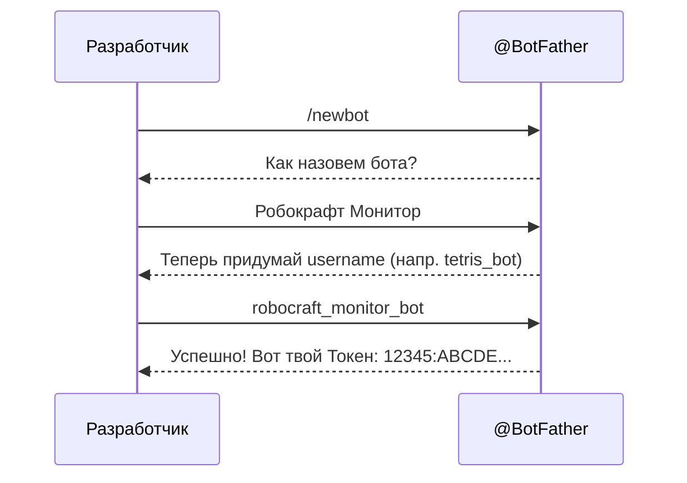
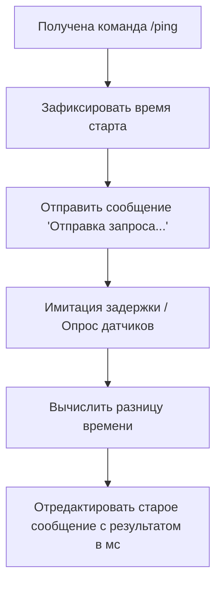

# Техническое руководство: Создание Telegram-бота для проекта «Робокрафт»

## Введение и исследование предметной области
В рамках вариативного задания было проведено исследование предметной области «Разработка чат-ботов». Telegram-боты представляют собой удобный интерфейс для взаимодействия человека и техники. В нашем случае бот выступает пультом мониторинга состояния робота «Робокрафт». 

**Стек технологий:**
- Язык программирования: Python 3.10+
- Библиотека: `pyTelegramBotAPI` (Telebot)
- Среда выполнения: Локальный ПК / Сервер (VPS)

---

## Архитектура проекта

Ниже представлена общая архитектура взаимодействия пользователя, Telegram API и нашего Python-скрипта.

```mermaid
graph TD
    User([Пользователь]) -- "Отправляет команду /status" --> TelegramApi[Telegram API]
    TelegramApi -- "Передает JSON (Long Polling)" --> BotApp[Приложение бота (Python)]
    BotApp -- "Читает данные о роботе" --> RobotState[(Состояние робота)]
    BotApp -- "Отправляет ответный JSON" --> TelegramApi
    TelegramApi -- "Показывает сообщение" --> User
```
*Рис. 1. Архитектура взаимодействия бота.*

---

## Пошаговая инструкция по созданию бота

### Шаг 1: Регистрация бота в Telegram
Для начала необходимо зарегистрировать бота и получить уникальный токен.

1. Откройте Telegram и найдите официального бота **@BotFather**.
2. Отправьте ему команду `/newbot`.
3. Придумайте имя бота (например, `Robocraft_Bot`) и его юзернейм (обязательно заканчивается на `bot`).
4. После успешного создания вы получите сообщение с **HTTP API Token**. Сохраните его.


*Рис. 2. Диаграмма последовательности создания бота.*

### Шаг 2: Настройка окружения
Перейдите в папку `src` и установите необходимые зависимости.

```bash
cd src
pip install -r requirements.txt
```

### Шаг 3: Написание базового кода
Создайте файл `bot.py` и добавьте базовую логику инициализации и эхо-ответов.

```python
import telebot

TOKEN = 'YOUR_BOT_TOKEN_HERE'
bot = telebot.TeleBot(TOKEN)

@bot.message_handler(commands=['start'])
def send_welcome(message):
    bot.reply_to(message, "Привет! Я бот для управления Робокрафтом.")

bot.infinity_polling()
```

### Шаг 4: Реализация пользовательского функционала (Use Cases)
Бот должен уметь обрабатывать различные команды пользователя.

```mermaid
usecase
    title Диаграмма прецедентов (Use Cases) бота Робокрафт
    User((Пользователь))
    User --> (Узнать статус робота)
    User --> (Получить документацию)
    User --> (Проверить связь /ping)
```
*Рис. 3. Диаграмма прецедентов пользователя.*

Пример кода для проверки статуса:
```python
robot_state = {"status": "online", "battery": 85, "speed": 0}

@bot.message_handler(commands=['status'])
def check_status(message):
    status_msg = f"Батарея: {robot_state['battery']}%\nСостояние: {robot_state['status']}"
    bot.send_message(message.chat.id, status_msg)
```

---

## Модификация проекта: Проверка пинга и асинхронные ответы

В рамках **творческого пункта** в базовый функционал бота была добавлена модификация — команда `/ping`. 
Эта команда позволяет пользователю измерить условную задержку сети при обращении к роботу. Для создания эффекта реалистичности бот сначала отправляет сообщение, затем измеряет время, редактирует отправленное сообщение и выводит результат пользователю (имитация асинхронного обновления интерфейса).

### Логика работы модификации (Flowchart)


*Рис. 4. Алгоритм работы команды /ping.*

**Пример реализации модификации:**
```python
import time

@bot.message_handler(commands=['ping'])
def ping_robot(message):
    start_time = time.time()
    msg = bot.send_message(message.chat.id, "Отправка запроса роботу...")
    # Имитация задержки на сети до ESP32
    time.sleep(0.5)
    ping_time = round((time.time() - start_time) * 1000)
    bot.edit_message_text(f"✅ Ответ получен!\nЗадержка: {ping_time} мс", 
                          chat_id=message.chat.id, 
                          message_id=msg.message_id)
```

## Финальный отчет и выводы
Разработанная архитектура бота оказалась легко масштабируемой. С помощью библиотеки `pyTelegramBotAPI` удалось за короткое время реализовать функционал информирования и мониторинга для аппаратного проекта. Модификация (команда `/ping`) показала, как можно обновлять сообщения в реальном времени, что крайне полезно для IoT-устройств.
